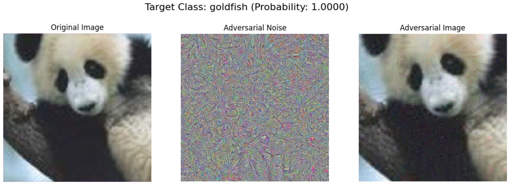

# Adversarial-Noise-Generation

A Python library for generating adversarial images by adding imperceptible noise to input images, causing image classification models to misclassify them as a specified target class.

## Overview



*Figure 1: Original Image (left), Adversarial Noise (center), and Adversarial Image (right)*


The Adversarial Noise Generator allows users to create adversarial examples by subtly modifying images so that a pre-trained image classification model misclassifies them as a target class chosen by the user or randomly selected. The modifications are minimal and often imperceptible to the human eye, yet they effectively deceive the model.

This tool is valuable for researchers and practitioners interested in understanding model vulnerabilities, testing robustness, and exploring the mechanics of adversarial attacks in deep learning.

## Features

- **Targeted Adversarial Attack**: Generate adversarial images targeting a specific class or a randomly selected class.
- **Visualization**: Display the original image, the adversarial noise, and the adversarial image side by side for comparison.
- **Classification Utilities**: Classify images and retrieve class indices and names.
- **Probability Calculation**: Obtain the probability of the adversarial image being classified as the target class.
- **Pre-trained Model Support**: Compatible with any pre-trained model from `torchvision`; defaults to ResNet50.
- **GPU Acceleration**: Utilize CUDA-enabled GPUs for faster computations if available.

## Installation

### Prerequisites

- **Python 3.10.12**
- **Conda** (Anaconda or Miniconda)

### Setup Instructions

1. **Clone the Repository**

   ```bash
   git clone https://github.com/yourusername/adversarial-noise-generator.git
   cd adversarial-noise-generator

2. **Create a Conda Environment**
   ```bash
   conda create -n adversarial_env python=3.10.12
   conda activate adversarial_env

3. **Install Dependencies**
   ```bash
   pip install -r requirements.txt
   
   
   
